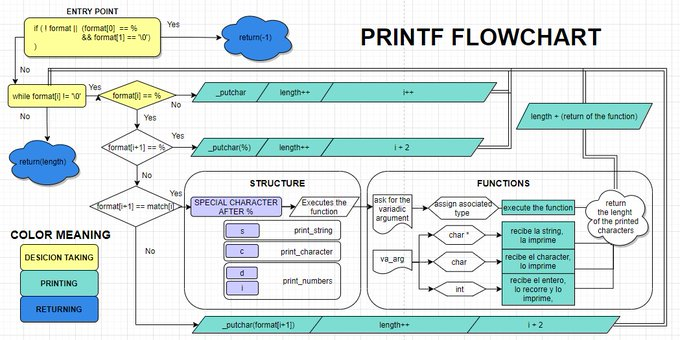

# ASR Software Enginering Printf Team Project 💻

## Printf 


### 💻 Synopsis
<h3 style="color:red;">Not all features is implemented 🚧</h3>
This is an implementaion of printf function that format and prints data to stdout 🖨️.
The _printf() function returns the total number of characters printed to the stdout(excluding the null byte at the end of strings) after a successful execution.
If an output error is encountered, a negative value of -1 is returned.

The prototype of this function is: int _printf(const char format, ...);

This means that it has one mandatory format argument, and an extra number of arguments that can be none, or many.

Each conversion specification is introduced by the character % and ends with a conversion specifier. In between there may be (in this order):

> Zero or more flags.
> 
> An optional field width.
> 
> An optional precision modifier.
> 
> An optional length modifier.

### The flag characters

| Flag | Description |
| :---- | :------------:|
|  `#`   |For o conversions the first character of the output string is made zero (by prefixing a 0 if it was not zero already). For x and X conversions, a nonzero result has the string "0x" or "0X" respectively added.|
|  `0`   | (Not implemented yet) The value should be zero padded. For d, i, o, u, x, and X the converted value is padded on the left with zeros. If the 0 and - flags both appear,the 0 flag is ignored. If a precision is given with a numeric conversion, the 0 flag is ignored.|
|  `-`   |The converted value is to be left adjusted on the field boundary, (Default is right justification) and padded with blanks in the right rather than on the left .|
|  `''`  | (Blank Space) The argument is padded with a single blank space before a positive number or empty string produced by a signed conversion. |
|  `+`   | A sign (+ or -) should always be placed before a number produced with a signed conversion. By default, only negative numbers have this sign. |

## 💻  Function prototype
```{r mon_bloc, echo = FALSE, WARNING = TRUE}

int _printf(const char *format, ...);
```
where format can be a simple string without any specifiers or it can contain specifiers and the arguments corresponding to them.

## 💻  Our project files:

* [main.h](https://github.com/samu-rize/holbertonschool-printf/blob/main/main.h): header file.
* [_printf.c](https://github.com/samu-rize/holbertonschool-printf/blob/main/_printf.c): contains the main logic.
* [choice_func.c](https://github.com/samu-rize/holbertonschool-printf/blob/main/choice_func.c): contains fonction to be executed depending on the condition.
* [ninja_Fun.c](https://github.com/samu-rize/holbertonschool-printf/blob/main/ninja_Fun.c): 🥷🏼 the mechanism file
* [_write_char.c](https://github.com/samu-rize/holbertonschool-printf/blob/main/_write_char.c): contains _write_char function which writes a characterto a file. 
* [man_3_printf](https://github.com/samu-rize/holbertonschool-printf/blob/main/man_3_printf): containsthe man page of the function.

## 💻  Functions we used:

* `write`
* `va_start` 
* `va_end` 
* `va_copy`
* `va_arg`

## 💻  _printf function flow:
* Check this flowchart explaining the functions flow


## 💻 _printf features:
* Supports a variety of format specifiers: %d, %s, %c, and %i .

| Specifier:|	Output							|	Example			|
| :---------|:----------------------------------|-----------------:	|
|	c		|		Character					|		H			|
|	s		|		String						|		Holberton		|
|	d		|		decimal integer				|		100			|	
|	i		|		Integer						|		100			|
|	%		|		% followed by another %		|		%			|

* Easy integration with existing C projects.
* Customizable and extensible to suit your needs.
* Lightweight and efficient.

## 💻  Compilation and testing

#### Compiling via:
```{r mon_bloc, echo = FALSE, WARNING = TRUE}
$ gcc -Wall -Werror -Wextra -pedantic *.c
```
### EXEMPLE
```
_printf("cohort %d is the best cohort ever!\n", 21); //cohort 21 is the best cohort ever!

```

## 💻 Usage:

To use our _printf in your C project, follow these steps:

1. Download the _Printf library files from [GitHub repository](https://github.com/samu-rize/holbertonschool-printf).
2. Include the main.h header file in your C source file.
3. Compile your project along with the _printf source files.
### EXEMPLE
```
#include "main.h"
int main() {
    int num = 42;
    char* message = "Hello, world!";
    
    _printf("The answer is: %d\n", num); <code style="color : aquamarine"> The answer is 42
    _printf("Message: %s\n", message); <code style="color : aquamarine"> Message: Hello, world!</code>
}
```
## 👨‍💻 Authors:
* [Adib Ben Haddada](https://github.com/Adib-96)
* [Ranim Zaouga](https://github.com/RanimZaouga)
* [Samir Arfaoui](https://github.com/samu-rize)


